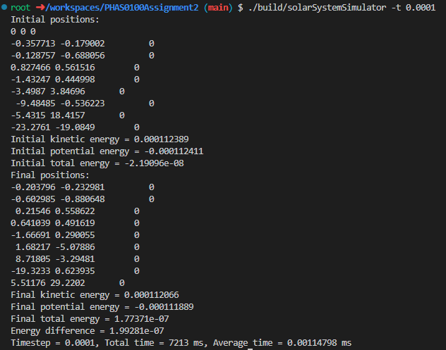
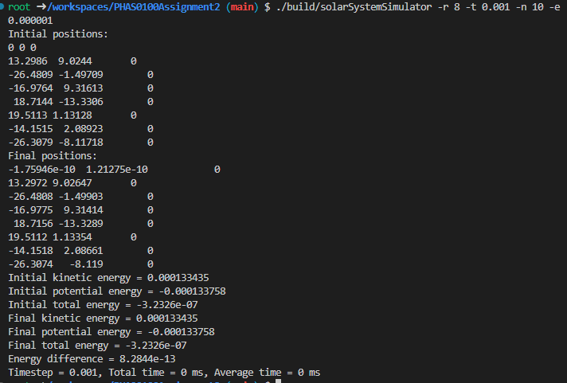
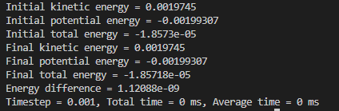

# A Virtual Solar System

This is the starting repository for assignment 2 of PHAS0100: Research Computing with C++. You may add or remove C++ files in any directory. You should organise the files as you see fit but do read the Folder Structure section below to understand the intended use of the existing folders.

## Installing dependencies

We are using the package manager Conan to install the dependencies Catch2 and Eigen. In order to use CMake's `Release` target for performance and `Debug` for debugging, the libraries must be installed twice with:

```
conan install . --output-folder=build --build=missing -s build_type=Debug
conan install . --output-folder=build --build=missing -s build_type=Release
```

If you delete the `build` directory to clean your build, you may have to install the dependencies again.

## Building

To build from the project root directory you should run:

```
cmake -S . -B build -DCMAKE_BUILD_TYPE=Release
cmake --build build
```

If you wish to debug your code, you should replace `Release` with `Debug`. For performance measurements, ensure you have built with the `Release` target.

## Testing

Once the project has been built, it can be tested by running:

```
cd build
ctest
```

## Folder structure

The project is split into four main parts aligning with the folder structure described in [the relevant section in Modern CMake](https://cliutils.gitlab.io/modern-cmake/chapters/basics/structure.html):

- `app/` contains all code implementing the command-line application.
- `lib/` contains all non-app code. Only code in this directory can be accessed by the unit tests.
- `include/` contains all `.hpp` files.
- `test/` contains all unit tests.

You are expected to edit the `CMakeLists.txt` file in each folder to add or remove sources as necessary. For example, if you create a new file `test/particle_test.cpp`, you must add `particle_test.cpp` to the line `add_executable(tests test.cpp)` in `test/CMakeLists.txt`. Please ensure you are comfortable editing these files well before the submission deadline. If you feel you are struggling with the CMake files, please see the Getting Help section of the assignment instructions.

## Usage Instructions

You should fill in the instructions for using the app here.
For solarSystemSimulator in section 1.3, we can build with following commands.

```
./build/solarSystemSimulator -h
./build/solarSystemSimulator -help
./build/solarSystemSimulator -t (timestep)
./build/solarSystemSimulator -timestep (timestep)
./build/solarSystemSimulator -n (number of steps)
./build/solarSystemSimulator -numsteps (number of steps)
./build/solarSystemSimulator -t (timestep) -n (number of steps)
```
The output of 1.3 with 1 full year simulation and 0.0001 dt is as follows.


The position is in order Sun, Mercury, Venus, etc.
So the Earth is the fourth one which initial position is (0.827466, 0.561516, 0) and the final position is (0.831277, 0.557608, 0) which is close to initial position after 1 year simulation. 

2.2 Benchmarking the simulation together with the 2.1 output




We simulate 8 different time step from 0.1 down to 0.00005. From the results,we can see that when dt is large until 0.001, the accuracy is decreasing. I also compare using optimizer O2 and without optimizer O0.


But it seems that the optimizer have no much influence in my specific case. However, it is still a good starting point to use O2 optimizer. And combine the accuracy performance. We can see that using time step 0.001 and O2 would be a good balance in my case.

2.3 Increase the scale solar system with random generator

```
./build/solarSystemSimulator -s -t (timestep) -n (number of steps) -e (epsilon)
./build/solarSystemSimulator -r (number of particles) -t (timestep) -n (number of steps) -e (epsilon)
```

With timestep 0.001, number of step 10 and epsilon 0.000001. I summarize with 8, 64, 256, 1024 and 2048 particles as follows.
8:

64:

256:

1024:

2048：


2.4
a. For the main loop, since we have no nested loop in main loop. We use schedule to compare the difference. For different chunk size and type of schedule we have the following results.

With OpenMP and 2048 particles 0.001 timestep 3000 number of steps epsilon 1e-8.
Without Parallelizing with OpenMP:

Static and chunk size 1:

Static and chunk size 4:

Dynamic and chunk size 4:

Guided and chunk size 4:

We can see that the main loop when applying different type and chunk size
have different performance. And they are very close. The dynamic and guided type with 4 chunk size outperform than the static. And by checking the output, all the simulation are correct. with different parallelization.

b.
Strong:

| `OMP_NUM_THREADS | Time (ms) | Speedup |
|---|---|---|
| 1 | 189754 | 1.00 |
| 2 | 105523 | 1.80 |
| 3 | 78319 | 2.42 |
| 4 | 63789 | 2.97 |
| 5 | 54985 | 3.45 |
| 6 | 48980 | 3.87 |
| 7 | 43377 | 4.37 |
| 8 | 38868 | 4.88 |
| 16 | 24275 | 7.82 |

Weak:

| `OMP_NUM_THREADS | Num Particles | Time (ms) | Speedup |
|---|---|---|---|
| 1 | 1024 | 47660 | 1.00 |
| 2 | 2048 | 104839 | 0.45 |
| 3 | 3072 | 170110 | 0.28 |
| 4 | 4096 | 237221 | 0.20 |
| 5 | 5120 | 309191 | 0.15 |
| 6 | 6144 | 384245 | 0.12 |
| 7 | 7168 | 462648 | 0.10 |
| 8 | 8192 | 555014 | 0.09 |
| 16 | 16384 | 1457117 | 0.03 |

## Credits

This project is maintained by Dr. Jamie Quinn as part of UCL ARC's course, Research Computing in C++.
